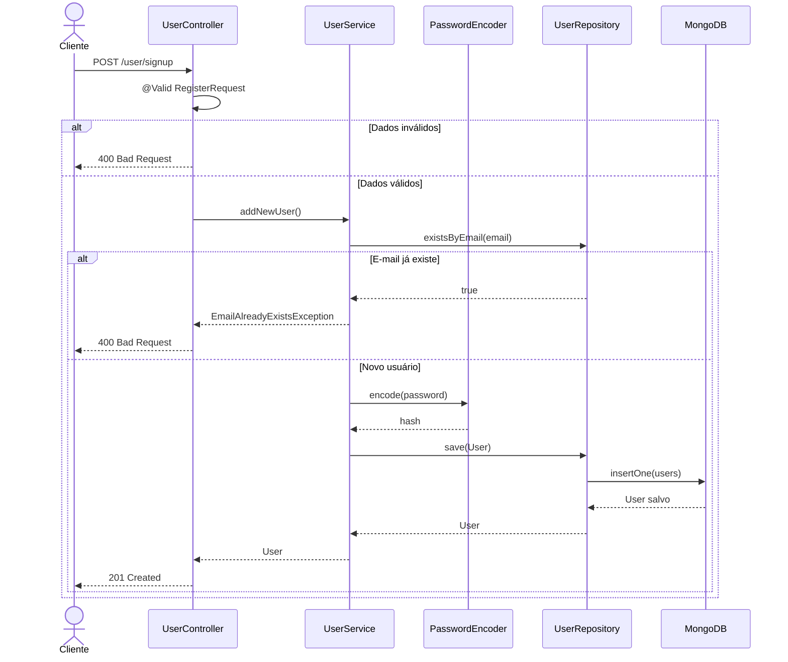
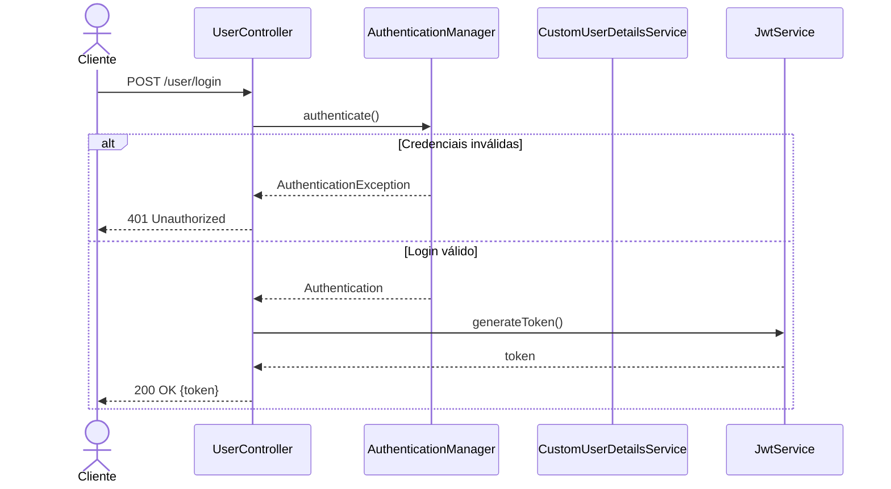
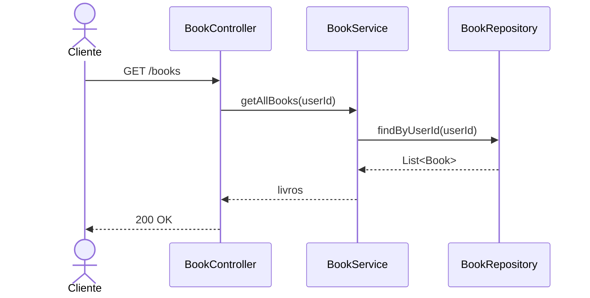

# RTM — Matriz de Rastreabilidade de Requisitos

**GoldenLibrary · Qualidade de Software · 2026/1**

A Matriz de Rastreabilidade de Requisitos (RTM) mapeia cada requisito funcional aos respectivos testes automatizados, garantindo cobertura completa das regras de negócio, segurança e persistência da aplicação.

Todos os testes utilizam infraestrutura real com Testcontainers (MongoDB). O uso de mocks foi removido conforme requisito do projeto.

## Índice
- [RF01 — Cadastro de Usuários](#rf01--cadastro-de-usuários)
- [RF02 — Autenticação JWT](#rf02--autenticação-jwt)
- [RF03 — Proteção de Rotas](#rf03--proteção-de-rotas)
- [RF04 — Listagem de Livros](#rf04--listagem-de-livros)
- [RF05 — Busca por Título](#rf05--busca-por-título)
- [RF06 — Filtro por Status](#rf06--filtro-por-status)
- [RF07 — Buscar Livro por ID](#rf07--buscar-livro-por-id)
- [RF08 — Cadastro de Livro](#rf08--cadastro-de-livro)
- [RF09 — Atualização de Livro](#rf09--atualização-de-livro)
- [RF10 — Deleção de Livro](#rf10--deleção-de-livro)
- [RF11 — Validação de Dados](#rf11--validação-de-dados)
- [RF12 — Isolamento de Dados entre Usuários](#rf12--isolamento-de-dados-entre-usuários)
- [Resumo da Cobertura](#resumo-da-cobertura)

---

## RF01 — Cadastro de Usuários

O sistema deve permitir o cadastro de novos usuários com senha criptografada, validação de e-mail e atribuição automática de role padrão.

### Diagrama UML — Cadastro de Usuário

| ID | Teste | Classe | Tipo | Cobre |
| :--- | :--- | :--- | :--- | :--- |
| RF01-T01 | deveCadastrarUsuarioComSenhaCriptografada | UserServiceTest | Integração | BCrypt da senha |
| RF01-T02 | devePersistirUsuarioNoBanco | UserServiceTest | Integração | Persistência MongoDB |
| RF01-T03 | deveAtribuirRoleUserPorPadrao | UserServiceTest | Caixa Branca | Role USER automática |
| RF01-T04 | existsByEmailDeveRetornarTrue | UserServiceTest | Caixa Branca | E-mail existente |
| RF01-T05 | existsByEmailDeveRetornarFalse | UserServiceTest | Caixa Branca | E-mail inexistente |
| RF01-T06 | deveAceitarFormatosDeEmailValidos | UserServiceTest | Parametrizado | Formatos válidos |
| RF01-T07 | shouldRegisterUserAndReturn201 | UserControllerTest | Caixa Preta (E2E) | POST retorna 201 |
| RF01-T08 | shouldReturn400ForDuplicateEmail | UserControllerTest | Caixa Preta (E2E) | E-mail duplicado |

###RF02 — Autenticação JWT
O sistema deve autenticar usuários e retornar token JWT válido.
###Diagrama UML — Login

| ID | Teste | Classe | Tipo | Cobre |
| :--- | :--- | :--- | :--- | :--- |
| RF02-T01 | shouldAuthenticateAndReturnJwtToken | UserControllerTest | E2E | Login válido |
| RF02-T02 | shouldReturn401ForInvalidCredentials | UserControllerTest | E2E | Usuário inexistente |
| RF02-T03 | shouldReturn401ForWrongPassword | UserControllerTest | E2E | Senha inválida |

###RF03 — Proteção de Rotas
O sistema deve bloquear acesso sem JWT válido.
###Diagrama UML — Proteção JWT
| ID | Teste | Classe | Tipo | Cobre |
| :--- | :--- | :--- | :--- | :--- |
| RF03-T01 | shouldReturn401WhenCreatingBookWithoutToken | BookControllerTest | E2E | Rota protegida sem token |

##RF04 — Listagem de Livros
O sistema deve listar apenas os livros do usuário autenticado.
###Diagrama UML — Listagem

### Matriz RF04
| ID | Teste | Classe | Tipo | Cobre |
|---|---|---|---|---|
| RF04-T01 | `shouldReturnOnlyBooksFromUser` | `BookServiceTest` | Integração | Filtra por userId |
| RF04-T02 | `shouldReturnEmptyListWhenNoBooksExist` | `BookServiceTest` | Integração | Lista vazia |
| RF04-T03 | `shouldListOnlyAuthenticatedUserBooks` | `BookControllerTest` | E2E | Isolamento de livros |

---

## RF05 — Busca por Título
O sistema deve permitir busca parcial case-insensitive por título.

### Matriz RF05
| ID | Teste | Classe | Tipo | Cobre |
|---|---|---|---|---|
| RF05-T01 | `shouldSearchByPartialTitleCaseInsensitive` | `BookServiceTest` | Integração | Busca parcial |
| RF05-T02 | `shouldNotReturnOtherUsersBooksOnTitleSearch` | `BookServiceTest` | Integração | Isolamento |
| RF05-T03 | `shouldSearchByPartialTitle` | `BookControllerTest` | E2E | Endpoint `GET /books?title` |

---

## RF06 — Filtro por Status
O sistema deve filtrar livros pelo status de leitura.

### Matriz RF06
| ID | Teste | Classe | Tipo | Cobre |
|---|---|---|---|---|
| RF06-T01 | `shouldFilterByEachReadingStatus` | `BookServiceTest` | Parametrizado | `WANT_TO_READ`, `READING`, `READ` |
| RF06-T02 | `shouldFilterBooksByReadingStatus` | `BookControllerTest` | E2E | `GET /books/filter` |

---

## RF07 — Buscar Livro por ID
O sistema deve retornar apenas livros pertencentes ao usuário autenticado.

### Matriz RF07
| ID | Teste | Classe | Tipo | Cobre |
|---|---|---|---|---|
| RF07-T01 | `shouldReturnBookByIdWhenBelongsToUser` | `BookServiceTest` | Caixa Branca | Livro do usuário |
| RF07-T02 | `shouldNotReturnAnotherUsersBookById` | `BookServiceTest` | Caixa Branca | Proteção ownership |

---

## RF08 — Cadastro de Livro
O sistema deve permitir cadastro de livros associados ao usuário autenticado.

### Matriz RF08
| ID | Teste | Classe | Tipo | Cobre |
|---|---|---|---|---|
| RF08-T01 | `shouldCreateBookWithUserIdAndTimestamps` | `BookServiceTest` | Integração | userId + timestamps |
| RF08-T02 | `shouldCreateBookAndReturn201` | `BookControllerTest` | E2E | `POST /books` |
| RF08-T03 | `shouldReturn400WhenRequiredFieldsAreMissing` | `BookControllerTest` | E2E | Campos obrigatórios |

---

## RF09 — Atualização de Livro
O sistema deve atualizar apenas livros do próprio usuário.

### Matriz RF09
| ID | Teste | Classe | Tipo | Cobre |
|---|---|---|---|---|
| RF09-T01 | `shouldUpdateBookWithNewData` | `BookServiceTest` | Integração | Atualização completa |
| RF09-T02 | `shouldNotUpdateAnotherUsersBook` | `BookServiceTest` | Caixa Branca | Ownership |
| RF09-T03 | `shouldUpdateBookAndReturn200` | `BookControllerTest` | E2E | `PUT /books/{id}` |
| RF09-T04 | `shouldReturn404WhenUpdatingAnotherUsersBook` | `BookControllerTest` | E2E | Livro de outro usuário |

---

## RF10 — Deleção de Livro
O sistema deve remover apenas livros pertencentes ao usuário autenticado.

### Matriz RF10
| ID | Teste | Classe | Tipo | Cobre |
|---|---|---|---|---|
| RF10-T01 | `shouldDeleteBookAndReturnDeleted` | `BookServiceTest` | Integração | Remoção do banco |
| RF10-T02 | `shouldReturnNotFoundWhenBookDoesNotExist` | `BookServiceTest` | Caixa Branca | ID inexistente |
| RF10-T03 | `shouldReturnForbiddenWhenBookBelongsToAnotherUser` | `BookServiceTest` | Caixa Branca | Ownership |
| RF10-T04 | `shouldDeleteBookAndReturn204` | `BookControllerTest` | E2E | `DELETE 204` |
| RF10-T05 | `shouldReturn404WhenDeletingNonExistentBook` | `BookControllerTest` | E2E | Livro inexistente |
| RF10-T06 | `shouldReturn403WhenDeletingAnotherUsersBook` | `BookControllerTest` | E2E | Livro de outro usuário |

---

## RF11 — Validação de Dados
O sistema deve validar entradas usando Bean Validation.

### Matriz RF11
| ID | Teste | Classe | Tipo | Cobre |
|---|---|---|---|---|
| RF11-T01 | `shouldReturn400WhenNameIsBlank` | `UserControllerTest` | E2E | Nome obrigatório |
| RF11-T02 | `shouldReturn400WhenEmailIsInvalid` | `UserControllerTest` | E2E | Email inválido |
| RF11-T03 | `shouldReturn400WhenPasswordIsTooShort` | `UserControllerTest` | E2E | Senha curta |
| RF11-T04 | `shouldReturn400WhenRequiredFieldsAreMissing` | `BookControllerTest` | E2E | Campos obrigatórios |

---

## RF12 — Isolamento de Dados entre Usuários
O sistema deve impedir acesso a dados de outros usuários.

### Matriz RF12
| ID | Teste | Classe | Tipo | Cobre |
|---|---|---|---|---|
| RF12-T01 | `shouldReturnOnlyBooksFromUser` | `BookServiceTest` | Integração | Listagem isolada |
| RF12-T02 | `shouldNotReturnOtherUsersBooksOnTitleSearch` | `BookServiceTest` | Integração | Busca isolada |
| RF12-T03 | `shouldNotReturnAnotherUsersBookById` | `BookServiceTest` | Caixa Branca | GET isolado |
| RF12-T04 | `shouldNotUpdateAnotherUsersBook` | `BookServiceTest` | Caixa Branca | PUT isolado |
| RF12-T05 | `shouldReturnForbiddenWhenBookBelongsToAnotherUser` | `BookServiceTest` | Caixa Branca | DELETE isolado |
| RF12-T06 | `shouldListOnlyAuthenticatedUserBooks` | `BookControllerTest` | E2E | API isolada |

---

## Resumo da Cobertura

### Por Requisito
| Requisito | Total de Testes | Status |
|---|---|---|
| RF01 | 8 | ✅ |
| RF02 | 3 | ✅ |
| RF03 | 1 | ✅ |
| RF04 | 3 | ✅ |
| RF05 | 3 | ✅ |
| RF06 | 2 | ✅ |
| RF07 | 2 | ✅ |
| RF08 | 3 | ✅ |
| RF09 | 4 | ✅ |
| RF10 | 6 | ✅ |
| RF11 | 4 | ✅ |
| RF12 | 6 | ✅ |
| **Total** | **45** | **✅** |

### Por Tipo de Teste
| Tipo | Ferramenta |
|---|---|
| Integração | JUnit 5 + Testcontainers |
| Caixa Branca | JUnit 5 |
| Caixa Preta (E2E) | MockMvc |
| Parametrizados | JUnit Parameterized |
| Segurança JWT | Spring Security |
| Persistência MongoDB | Testcontainers |

### Cobertura de Código
| Métrica | Meta | Ferramenta |
|---|---|---|
| Cobertura de linhas | ≥ 80% | JaCoCo |
| Cobertura de branches | ≥ 80% | JaCoCo |
| Quality Gate | Passed | SonarCloud |
| CI Automatizado | Ativo | GitHub Actions |

📄 **Relatório disponível em:**  
`target/site/jacoco/index.html`
